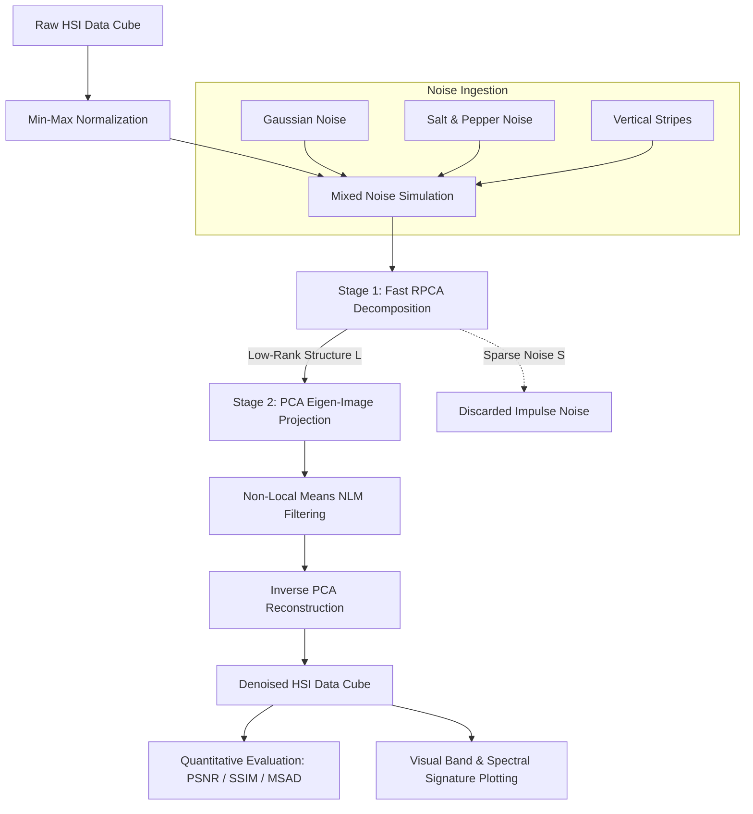

# SpectraClean: Hyperspectral Image (HSI) Mixed Noise Denoising Pipeline

[](https://www.python.org/)
[](LICENSE)
[]()
[](https://www.python.org/dev/peps/pep-0008/)

**SpectraClean** is a robust, modular Python pipeline for simulating and removing complex mixed noise from **Hyperspectral Images (HSI)**. It combines **Fast Randomized Robust Principal Component Analysis (RPCA)** with a **Principal Component Analysis and Non-Local Means (PCA-NLM)** spatial-spectral filtering framework to restore image quality while preserving fine spectral signatures.

---

## Table of Contents

- [Overview](#-overview)
- [Architecture & Pipeline Workflow](#-architecture--pipeline-workflow)
- [Repository Structure](#-repository-structure)
- [Key Features](#-key-features)
- [Installation](#-installation)
- [Usage Guide](#-usage-guide)
  - [1. Quickstart (Synthetic Demo)](#1-quickstart-synthetic-demo)
  - [2. Command Line Interface (CLI)](#2-command-line-interface-cli)
  - [3. Python API Usage](#3-python-api-usage)
- [Algorithmic Framework](#-algorithmic-framework)
  - [Step 1: Fast RPCA Decomposition](#step-1-fast-rpca-decomposition)
  - [Step 2: PCA-NLM Spatial-Spectral Filtering](#step-2-pca-nlm-spatial-spectral-filtering)
- [Quantitative Evaluation Metrics](#-quantitative-evaluation-metrics)
- [Hyperspectral Datasets](#-hyperspectral-datasets)
- [Project Documentation](#-project-documentation)
- [License](#-license)

---

## Overview

Hyperspectral sensors collect hundreds of narrow, contiguous spectral bands across the electromagnetic spectrum. However, raw HSI data cubes are frequently corrupted by real-world mixed noise during data acquisition, including:
- **Zero-mean Gaussian noise** (sensor thermal & read noise)
- **Sparse Salt & Pepper impulse noise** (dead/defective pixels)
- **Structural vertical stripe artifacts** (calibration drift across detector arrays)

`SpectraClean` provides a complete end-to-end framework to simulate these compound noise degradation models and restore HSI cubes to high quality without compromising spectral fidelity.

---

## Architecture & Pipeline Workflow



---

## Repository Structure

```
SpectraClean/
├── .gitignore               # Standard Python & dataset ignore rules
├── LICENSE                  # MIT open-source license
├── README.md                # Comprehensive project documentation
├── requirements.txt         # Project dependency specification
├── setup.py                 # Setuptools installer (`pip install -e .`)
├── main.py                  # Full-featured CLI execution entry point
├── Denoise.py               # Legacy script wrapper (100% backward compatible)
├── spectraclean/            # Core Python library package
│   ├── __init__.py          # Package exports & public API
│   ├── io.py                # Universal file loading (.npy, .mat) & normalization
│   ├── noise.py             # Mixed noise generator (Gaussian, S&P, Stripes)
│   ├── denoise.py           # RPCA (Fast Inexact ALM) & PCA-NLM algorithms
│   ├── metrics.py           # Evaluation metrics (PSNR, SSIM, MSAD)
│   └── visualize.py         # Matplotlib visualization & spectral plotting
├── docs/                    # Technical documentation
│   └── Project_Report.pdf   # Complete academic / technical project report
└── examples/                # Quickstart & example scripts
    └── quickstart.py        # Demo script using synthetic data (no external file needed)
```

---

## Key Features

- **Universal Dataset Support**: Loads both native MATLAB `.mat` files and NumPy `.npy` HSI data cubes. automatically caches `.mat` conversions for zero-overhead re-loading.
- **Realistic Mixed Noise Generator**:
  - Variable-variance **Gaussian noise** across spectral channels.
  - Variable-density **Salt & Pepper (impulse) noise**.
  - Random multi-column **stripe artifacts** simulating sensor line defects.
- **Two-Stage Restoration Engine**:
  - **Stage 1 (RPCA)**: Fast Inexact Augmented Lagrange Multiplier (ALM) with randomized SVD to separate low-rank structural scenes from sparse corruptions.
  - **Stage 2 (PCA + NLM)**: Projects low-rank data into principal orthogonal components, applying adaptive spatial Non-Local Means (NLM) filtering before inverse projection.
- **Comprehensive Benchmark Metrics**:
  - **PSNR** (Peak Signal-to-Noise Ratio)
  - **SSIM** (Structural Similarity Index Measure)
  - **MSAD** (Global Mean Spectral Angle Distance in degrees)
- **Rich Visualization Tools**:
  - Side-by-side band comparison plots (Original vs. Noisy vs. Denoised).
  - Single-pixel spectral signature profile curves across wavelengths.

---

## ⚙️ Installation

### 1. Clone the Repository
```bash
git clone https://github.com/ShivamGupta385/SpectraClean.git
cd SpectraClean
```

### 2. Set Up Virtual Environment (Recommended)
```bash
# On Linux/macOS
python3 -m venv venv
source venv/bin/activate

# On Windows (PowerShell)
python -m venv venv
.\venv\Scripts\Activate.ps1
```

### 3. Install Dependencies
```bash
pip install -r requirements.txt
```

Alternatively, install in editable mode:
```bash
pip install -e .
```

---

## Usage Guide

### 1. Quickstart (Synthetic Demo)
Run the self-contained demo script. No dataset download required!
```bash
python examples/quickstart.py
```
This generates a synthetic HSI data cube, adds mixed noise, runs the restoration pipeline, prints metric tables, and saves `quickstart_results.png`.

---

### 2. Command Line Interface (CLI)
`main.py` provides a rich set of command-line arguments:

```bash
# Run with default dataset file (Pavia_resized.npy)
python main.py --file Pavia_resized.npy

# Run with synthetic benchmark data and custom noise parameters
python main.py --synthetic --g-noise 0.12 --sp-noise 0.25 --stripes 0.3

# Customize RPCA rank and PCA components
python main.py --file your_dataset.mat --rank 60 --n-pca 24

# Save output comparison plot to image file
python main.py --synthetic --save-plot output_comparison.png --no-plot
```

#### Available CLI Options:
| Flag / Parameter | Default | Description |
| :--- | :--- | :--- |
| `-f`, `--file` | `Pavia_resized.npy` | Path to HSI data file (`.npy` or `.mat`) |
| `--synthetic` | `False` | Use synthetic HSI data cube for testing |
| `-g`, `--g-noise` | `0.1` | Upper bound for Gaussian noise variance $G$ |
| `-p`, `--sp-noise` | `0.2` | Upper bound for Salt & Pepper noise probability $P$ |
| `-s`, `--stripes` | `0.2` | Fraction of spectral bands with vertical stripes |
| `-r`, `--rank` | `75` | Estimated rank for RPCA decomposition |
| `-n`, `--n-pca` | `32` | Number of PCA components for spatial NLM filtering |
| `-b`, `--band` | `25` | Band index to display in visual comparison |
| `--save-plot` | `None` | Path to save figure (e.g., `results.png`) |
| `--no-plot` | `False` | Disable interactive GUI plot popups |

---

### 3. Python API Usage

You can seamlessly import `spectraclean` as a package into your own scripts or Jupyter Notebooks:

```python
from spectraclean import (
    load_hsi_file,
    normalize_hsi,
    add_mixed_noise,
    ultimate_pipeline,
    detailed_evaluation,
    plot_comparison
)

# 1. Load HSI Data Cube
raw_cube = load_hsi_file("Pavia_resized.npy")
clean_cube = normalize_hsi(raw_cube)

# 2. Inject Mixed Noise
noisy_cube = add_mixed_noise(
    clean_cube, 
    G=0.1,            # Gaussian noise limit
    P=0.2,            # Salt & Pepper probability
    stripe_ratio=0.2  # Stripe band ratio
)

# 3. Apply Denoising Pipeline
denoised_cube = ultimate_pipeline(noisy_cube, rank=75, n_pca=32)

# 4. Evaluate Metrics
psnr_val, ssim_val, msad_val = detailed_evaluation(clean_cube, denoised_cube)

# 5. Visualize Results
plot_comparison(clean_cube, noisy_cube, denoised_cube, band_idx=25)
```

---

## Algorithmic Framework

### Step 1: Fast RPCA Decomposition
An HSI dataset $M \in \mathbb{R}^{HW \times B}$ exhibits high correlation across spectral channels (low-rank structure $L$) alongside sparse impulse/stripe corruptions ($S$):
$$M = L + S$$

We solve the convex optimization problem using Inexact ALM:
$$\min_{L, S} \|L\|_* + \lambda \|S\|_1 \quad \text{subject to} \quad M = L + S$$

### Step 2: PCA-NLM Spatial-Spectral Filtering
1. **Dimension Reduction**: The low-rank matrix $L$ is centered and projected into $k$ principal orthogonal components using Randomized SVD:
   $$X_{PCA} = L \cdot V_k$$
2. **Spatial Non-Local Means (NLM)**: Each principal component eigen-image is filtered independently using self-similarity patch matching:
   $$\hat{I}(p) = \frac{\sum_{q} w(p,q) I(q)}{\sum_{q} w(p,q)}$$
3. **Reconstruction**: Denoised eigen-images are mapped back to the original HSI dimensions:
   $$\hat{L} = \hat{X}_{PCA} \cdot V_k^T + \mu$$

---

## Quantitative Evaluation Metrics

The pipeline measures restoration performance using three standard HSI quality indicators:

1. **PSNR (Peak Signal-to-Noise Ratio)**: Evaluates pixel-level spatial accuracy in decibels (dB). Higher is better.
2. **SSIM (Structural Similarity Index Measure)**: Measures spatial structure, contrast, and luminance preservation in $[0, 1]$. Higher is better.
3. **MSAD (Mean Spectral Angle Distance)**: Measures spectral vector deformation in degrees across all spatial locations:
   $$\text{SAD}(\mathbf{x}, \hat{\mathbf{x}}) = \arccos \left( \frac{\mathbf{x}^T \hat{\mathbf{x}}}{\|\mathbf{x}\|_2 \|\hat{\mathbf{x}}\|_2} \right)$$
   Lower MSAD indicates superior spectral fidelity.

---

## Hyperspectral Datasets

SpectraClean is compatible with all standard HSI benchmark datasets, including:

- **Pavia University Scene** ($610 \times 340 \times 103$ bands)
- **Indian Pines Scene** ($145 \times 145 \times 220$ bands)
- **Salinas Scene** ($512 \times 217 \times 224$ bands)

You can download `.mat` format benchmark datasets from the [UPV/EHU Hyperspectral Remote Sensing Group](https://www.ehu.eus/ccwintco/index.php/Hyperspectral_Remote_Sensing_Scenes).

---

## Project Documentation

A comprehensive project report explaining the mathematical derivation, experimental setup, and quantitative benchmark analysis is available under:
- [`docs/Project_Report.pdf`](docs/Project_Report.pdf)

---

## Author & Contributing

- **Author**: Shivam Gupta ([@ShivamGupta385](https://github.com/ShivamGupta385))
- Contributions, issues, and feature requests are welcome! Feel free to check the [issues page](https://github.com/ShivamGupta385/SpectraClean/issues).

---

## License

This project is licensed under the MIT License - see the [LICENSE](LICENSE) file for details.

